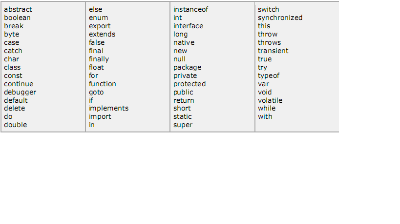

JS 快速入门
===========

JavaScript（简称 JS） 脚本由 JS 语句构成。
处于 HTML 标记 ``<scipt> ... </scipt>`` 之间。
可以把 ``<scipt> ... </scipt>`` 放在任意位置，但是最好放在 <head> 标记范围内。

 

"hello, world"
--------------

.. code-block:: html

    <html> 
    <body> 
     
    </body> 
    </html> 

空白符和换行
------------

Javascript 忽略空格，制表符以及换行符。
使用它们只是为了缩进，使代码更易于阅读

分号是可选的
------------

简单语句后面通常有一个分号，就像 C/C++, Java 那样。

.. note::
 每个语句单独一行，可以省略分号，多个语句放在一行，需要分号

.. code-block:: html

    

区分大小写
----------

JS 区分大小写。

注释
----

支持 ``//`` 和 ``/* */`` 两种风格。
支持 HTML 格式的注释 ``<!--``，必须对应 ``//-->``

JS 位置
-------

推荐位置：

* ``<head> ... </head>``
* ``<body> ... </body>``
* both
* 额外的文件，再加载到 ``<head> ... </head>``

数据类型
--------

* Numbers: 80
* Strings: "string"
* Boolean: true or false
  
变量
----

JS 的变量必须先声明，再使用，有点类似于 C/C++， Java 等。
变量的声明使用 **var** 关键字。

变量的作用域
------------

* 全局变量
* 局部变量
  
定义在函数外的变量是全局变量；定义在函数中的变量是局部变量。

变量名
------

* 不可以使用保留关键字
* 由字母，数字，下划线等构成，只能以字母、下划线开头。
* 大小写敏感

保留关键字：

运算符
------

``+, -, * , /, %, ++, --, ==, !=, >, <, >=, <=, &&, ||, !, &, |, ^,	~, <<, >>, >>>,
=, +=, -=, *=, /=, %=, ?:, typeof``

.. note:: >>> 逻辑右移， typeof 值为 "number", "string", "boolean"

if, switch ,for, while
----------------------

用法和 C/C++ 一样。

for ... in
----------

for (varName in object)
{
	
}

break, continue
---------------

用法请参考 C/C++。

函数定义
--------

使用函数之前先要定义它。
函数格式：函数关键字， 函数名， 参数列表（空），以及大括号包围的语句模块。
例如：

.. code-block:: html

     